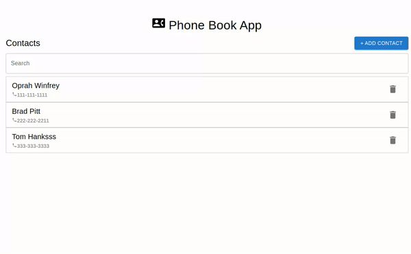
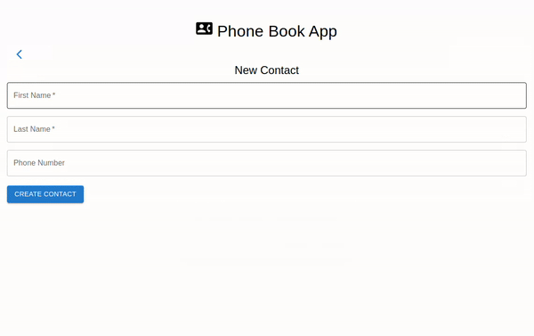

# Phonebook-APP

The Phonebook App is the perfect tool for managing your contacts. With a simple and intuitive interface, you can easily create, read, update and delete your contacts. This app is powerful yet easy to use and is the perfect solution for keeping your contacts.

It was created with React for the front end and Spring Boot + MongoDB at the back end.

## Features

The app allows users to:

- Create contacts
- Read contacts
- Edit contacts
- Delete contacts

## Screenshots

### Creating a contact

The creation of new contacts is done by clicking on the button `Add Contact`. It shows a form where the user can enter the first name, last name, and phone number.

### Search contacts

The user can search for contacts using the search field. It considers both the first and last names. The search/filtering is done on the back end.

### Deleting contacts

When clicking on the delete (Trash icon) button, a confirmation modal is shown. If the user confirms it, the contact will be deleted.

### Fields validation

The application validates empty fields and also applies a mask to the phone number field to ensure the user sends the correct data to the back end. Additionally, validation is also done on the back end.

## Technologies Used

- Front end: JavaScript, React, Context API, States, and Hooks.
- Back end: Java, Spring Boot, Spring Data, Testcontainers, JUnit.
- Database: MongoDB
- Infrastructure: Docker, Docker-Compose, OpenAPI, Make, Maven, NPM
- Documentation: OpenAPI, Swagger, JavaDoc

## Tests

The back end has both unit and integration tests with _93% coverage_.

## API Documentation

You can access the API documentation in the /docs folder.

It is possible to generate the documentation by running `make generate-docs` in the root directory of this repository.

## Requirements

For building and running this application, you need to have:

- [Node.js](https://nodejs.org/en/)
- [Java 17](https://www.oracle.com/java/technologies/javase/jdk17-archive-downloads.html)
- [Docker](https://www.docker.com/)
- [Make](https://www.gnu.org/software/make/)

## Running the App

You can build and run the application by running:

`make build-run`

Or, if you manually built the application it is also possible to start the whole application using docker-compose directly.

Simply run `docker-compose up` to start the MongoDB instance, back end, and front end applications, and you are good to go.

You can access the front end application at http://localhost:3000 after running it.

## TODOs

- Create tests in the front end using Jest/RTE.
- Create profiles and configuration for other environments (stage/prod).
